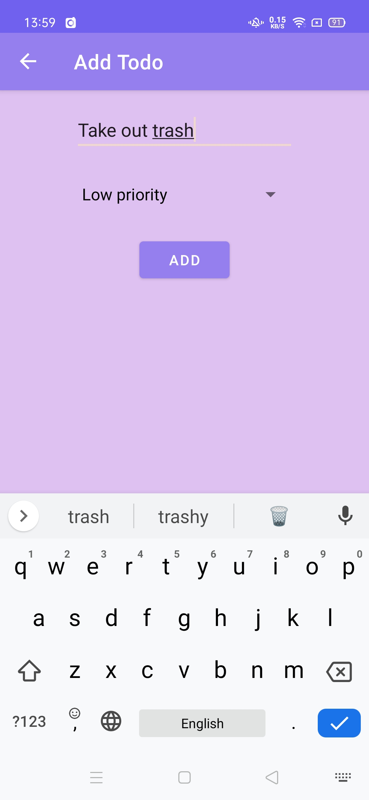
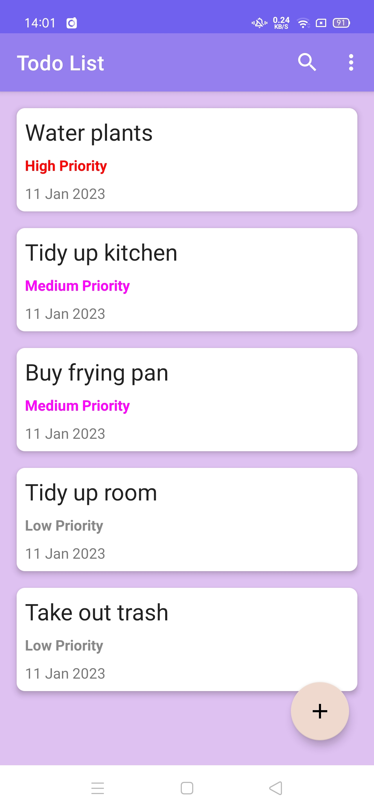
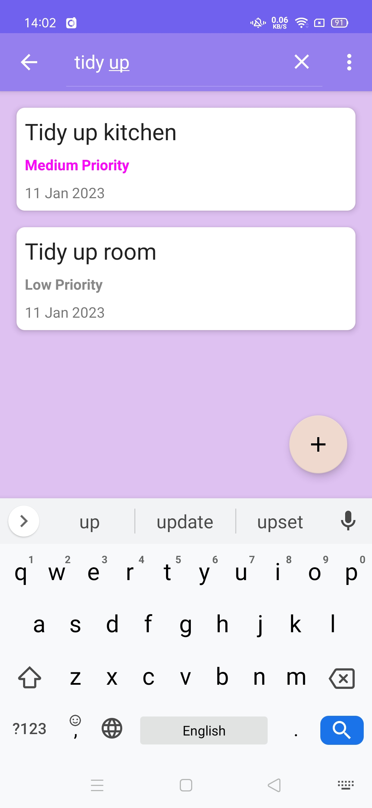
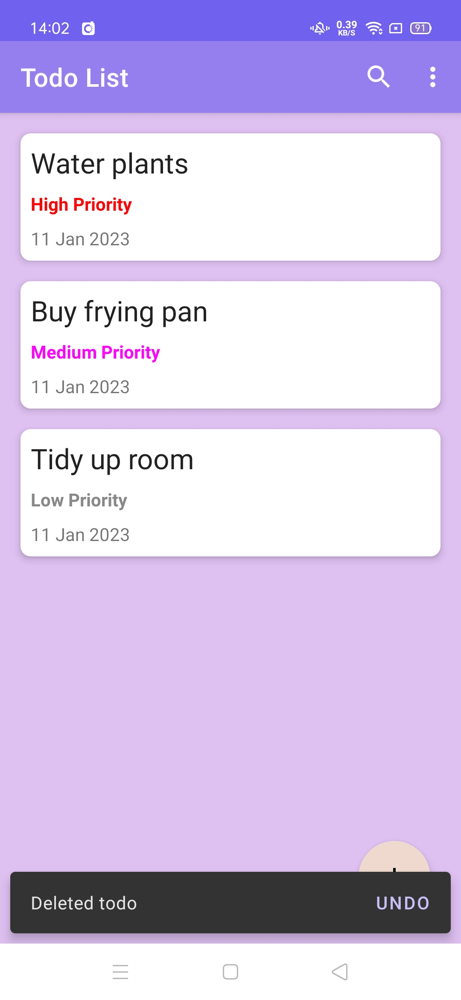

# TodoMVVM
Simple todo-list Android app using MVVM architecture

The app is designed to add, sort, and prioritize your todo items in an interactive list. 
&ensp;

## Libraries
- Room for persistent storage
- Dagger-Hilt for dependency injection
- Coroutines for asynchronous flows

## App Screenshots
### Add Todo

 

&ensp;
### Todo List Main Page

 

&ensp;
### Search View for Filtering

 

&ensp;
### Delete Todos by Swiping Action

 

&ensp;

## References
- https://www.youtube.com/playlist?list=PLoCYbRS6dPkJMThvLiPEaWGQ0tV2XL4v8
- https://www.youtube.com/watch?v=A7CGcFjQQtQ
- https://www.youtube.com/watch?v=hHbWF1Bvgf4
